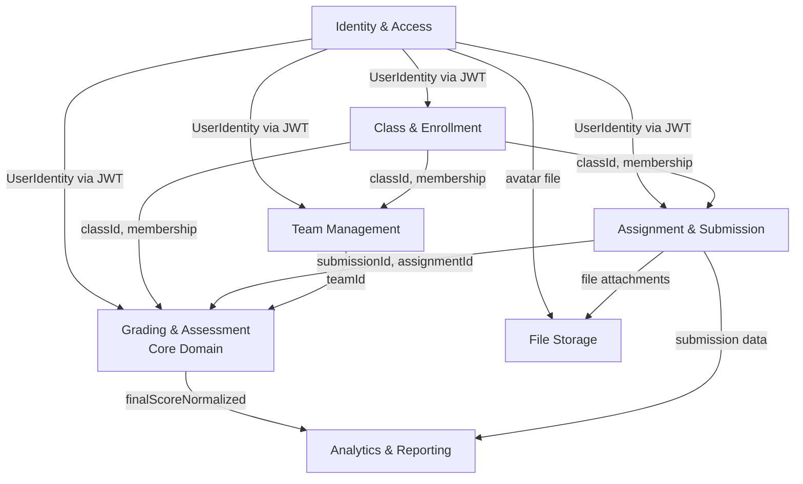

# Bounded Context Map

Карта взаимодействий между контекстами. Все стрелки — синхронная интеграция через REST (Upstream/Downstream). IAM передаёт идентификатор через JWT-заголовок; все прочие зависимости — через UUID-ключи в теле запроса.

## Паттерны интеграции

| Пара контекстов | Паттерн | Комментарий |
|-----------------|---------|-------------|
| IAM -> все | Shared Kernel | UUID пользователя в JWT — общий идентификатор |
| CLASS -> ASSIGN/TEAM/GRADE | Customer/Supplier | Class предоставляет `classId` и членство; остальные BC зависят от него |
| ASSIGN -> GRADE | Customer/Supplier | Assignment предоставляет `submissionId`; Grading потребляет |
| TEAM -> GRADE | Customer/Supplier | Team предоставляет `teamId`; Grading потребляет |
| GRADE -> STATS | Published Language | `finalScoreNormalized` (0-100) как стабильный контракт |

Anti-Corruption Layer между контекстами не реализован — интеграция идёт напрямую через общие UUID. При росте системы рекомендуется ввести ACL на границе GRADE -> STATS.
