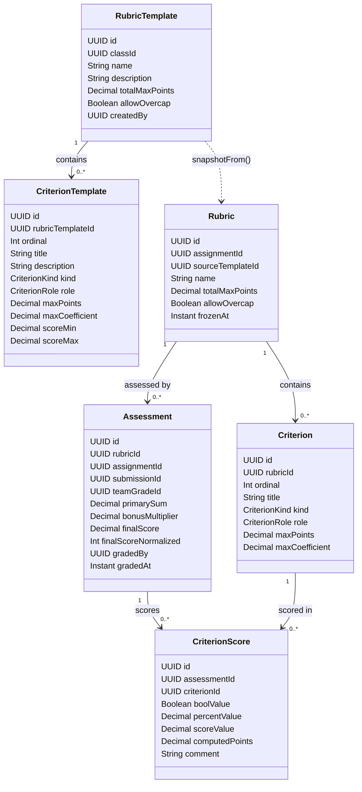
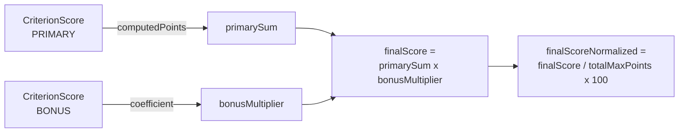
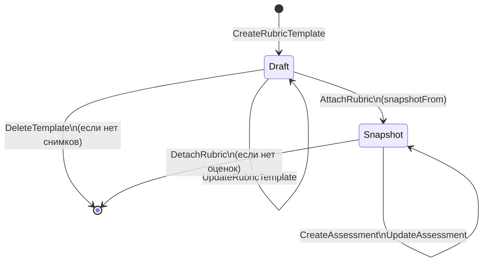

# Система критериев оценивания

## Статус реализации требований ТЗ

| Требование ТЗ | Статус | Реализация |
|--------------|--------|-----------|
| Три типа критериев: булевый, процентный, балльный | Готово | `CriterionKind`: BOOLEAN, PERCENT, SCORE |
| Частичное влияние на оценку | Готово | `CriterionTemplate.maxPoints` + инвариант суммы |
| Основные критерии (баллы) | Готово | `CriterionRole.PRIMARY` |
| Дополнительные критерии (коэффициент) | Готово | `CriterionRole.BONUS`, `maxCoefficient` в (1, 2] |
| Описание преподавателем: текст + влияние | Готово | `title`, `description`, `maxPoints`/`maxCoefficient` |
| Экспорт конфигурации критериев | Готово | `GET /rubric-templates/{id}/export` -> JSON |
| Импорт конфигурации критериев | Готово | `POST /classes/{classId}/rubric-templates/import` |
| Иммутабельность при оценивании | Готово | Rubric = snapshot (`frozenAt`), не изменяется после создания |
| Командное оценивание по критериям | Готово | `Assessment.teamGradeId` |

## Агрегатная модель



## Формула расчёта итогового балла



Вклад BONUS-критерия в мультипликатор зависит от типа:

| CriterionKind | Формула вклада |
|---------------|---------------|
| BOOLEAN | `maxCoefficient` при `true`, `1.0` при `false` |
| PERCENT | `1 + (percent / 100) x (maxCoefficient - 1)` |
| SCORE | `1 + ((value - min) / (max - min)) x (maxCoefficient - 1)` |

## Жизненный цикл рубрики



## Рекомендуемые улучшения (To-Be)

### Domain Events

Сейчас интеграция между BC — синхронная через REST. Для аудита и масштабирования рекомендуется ввести события:

| Событие | Поля | Подписчик |
|---------|------|----------|
| `AssessmentCreated` | assessmentId, assignmentId, submissionId?, teamGradeId?, finalScoreNormalized, gradedBy | Analytics BC |
| `AssessmentUpdated` | assessmentId, newFinalScore, gradedBy | Analytics BC |
| `AssessmentDeleted` | assessmentId | Analytics BC |
| `RubricAttached` | rubricId, assignmentId, sourceTemplateId? | - |
| `RubricTemplateImported` | templateId, classId, importedBy | - |

### Value Objects

| Кандидат | Что инкапсулирует |
|----------|------------------|
| `MaxPoints` | NUMERIC > 0 и <= 1000, форматирование |
| `Coefficient` | NUMERIC в (1.0000, 2.0000] с валидацией |
| `NormalizedScore` | INT в [0, 100] |
| `CriterionConfig` | Пара (kind, role, maxPoints?, maxCoefficient?, scoreRange?) |

### Domain Service: RubricScoringFormula

Формула расчёта сейчас дублирована в трёх местах: бэк-сервис, `src/features/rubrics/domain/calculator.ts` (веб), `Services/RubricScoreCalculator.swift` (iOS). Рекомендуется выделить формулу в явный Domain Service на бэкенде:

```java
// domain/service/RubricScoringFormula.java
public ScoringResult calculate(Rubric rubric, List<CriterionScoreInput> inputs);
```

Клиенты используют локальный расчёт только для UX-отзывчивости; источник истины — бэкенд через `PUT /assessments/{id}`.
